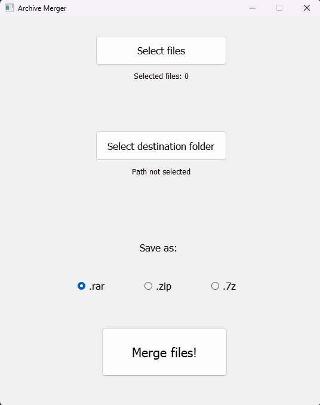

# Database_Connection_Checker

IMPORTANT: This app is a prototype! It works, but has some problems with larger archives and may be unstable.

Archive Merger

This app can be used for merging multiple archives into one.

Supported archive types:
- .rar
- .zip
- .7z

Usage:
1. Select files for merging
2. Select destination path (where the merged archive will be created)
3. Select output filetype
4. Merge!

Duplicates / Overwriting

When there is two or more folders that share the same name, only one folder will appear in merged archive (with original name), but it will contain files from all 'versions' of that folder.

When there is two or more files that share the same name, they will be re-named by adding "(x)" number at the end of filename. The number will be increasing untill no duplicate is found.
